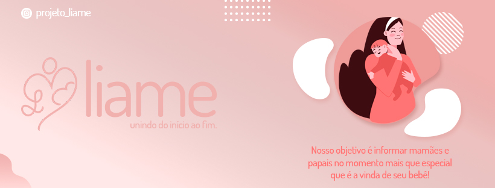

<h1 align="center">
    
</h1>

<h4 align="center"> 
	Liame, unindo do início ao fim!🤱🏻
</h4>

## 💻 Sobre o projeto

👶🏼 Liame - é uma forma de conectar especialistas e profissionais da área da saúde com mamães e papais para auxilia-los e ajuda-los durante o período da gestação e maternidade.

Os profissionais poderão se cadastrar na plataforma web enviando:
- uma docuemntação com sua especialidade e formação
- número de registro profissional válido e ativo

Projeto desenvolvido durante a **Curso técnico em informática para internet integrado ao ensino médio** oferecida pela ETEC Santa Isabel.

## 🛠 Tecnologias

As seguintes linguagens e ferramentas foram usadas na construção do projeto:

- PHP
- HTML
- CSS
- JavaScript
- Bootstrap
